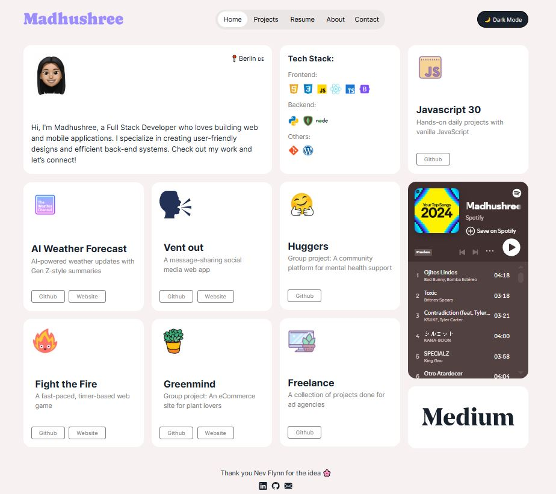

# 🌐 Personal Portfolio

Hey! I'm Madhushree Boyle, a Full Stack Developer passionate about crafting beautiful, user-focused web applications. This is the code for my personal portfolio website — built to showcase my projects, skills, and background.

## 🛠️ Tech Stack

 React, Tailwind CSS, TypeScript, HTML, CSS, JavaScript, Framer, Git, GitHub, Figma, Netlify (for deployment)

## ✨ Features

- Responsive design for all screen sizes
- Dark/Light mode toggle
- Interactive project cards
- Embedded Spotify & Medium widgets
- Clean and accessible UI

## 📸 Screenshots

## 🚀 Live Demo

Check it out here: [Madhushree's Profile](https://madhushreeboyle.netlify.app/)

## 🔮 Future Improvements

Here are a few features and enhancements I'm planning to add to this portfolio:

- 📱 Enhance Tablet responsiveness and navigation
- 🌗 Smooth dark/light mode toggle with animated transitions
- 🌐 Add SEO meta tags and social media previews
- 💬 Add a contact form with validation
- 📄 Create detailed project pages with descriptions, tech stack, and learnings
- 🧪 Add basic testing
- 📝 Maintain a changelog to document updates and progress
- 🟩 Use swapy to make drag and drop features for the cards

## 📬 Contact

If you'd like to connect or collaborate:

- LinkedIn: [Madhushree Boyle](https://www.linkedin.com/in/madhushreeb/)
- Email: boylemadhushree@gmail.com

---

Thanks for stopping by! ⭐ Feel free to fork or star this repo if you found it helpful.

